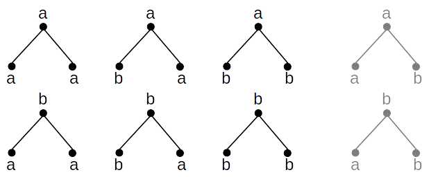
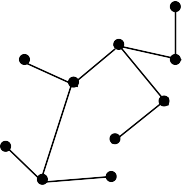

tree-labeling
=============

Generates all labelings of a given free tree with the specified alphabet

##Problem
Finding all labelings of a given free tree is an easy task if the unlabeled graph doesn't contain automorphism. In this case if the tree has *n* nodes, and the alphabet (that is used for the labeling) contains *m* elements, the tree has *m^n* labelings. Otherwise (if the graph has automorphism) then the number of labelings is strictly less than *m^n*.
For example consider the following free tree that has *3* node, and an alphabet that contains two letters: *a, b*:

As the example shows this tree would have *2^3=8* labelings, however due to the fact that the graph is symmetric, there are only *6* labelings.

##Usage
Calling the main procedure `get_labeled_graphs(L, maxlabel)` will print out all labelings of the given tree. The list *L* has to contain a proper pre-order traversal of a tree and *maxlabel* has to be a positive integer (that represents the size of the alphabet). For example the following tree has many pre-order traversals:

- *[0, 1, 2, 3, 4, 4, 5, 5, 3, 4]*

- *[0, 1, 2, 2, 3, 3, 1, 2, 1, 2]*

- *[0, 1, 1, 2, 2, 1, 2, 3, 2, 3]*

- ...

##Examples

- *L=[0, 1, 2]*
>>labelings:  
*[0, 0, 0]*  
*[0, 1, 0]*  
*[0, 1, 1]*  
*[1, 0, 0]*  
*[1, 1, 0]*  
*[1, 1, 1]*  
Count of possible labelings: *6*

- *L=[0, 1, 2, 3, 1, 2, 3]*
>>labelings:  
*[0, 0, 0, 0, 0, 0, 0]*
*[0, 0, 0, 1, 0, 0, 0]*
*[0, 0, 1, 0, 0, 0, 0]*
*[0, 0, 1, 1, 0, 0, 0]*  
*[0, 1, 0, 0, 0, 0, 0]*
*[0, 1, 0, 1, 0, 0, 0]*
*[0, 1, 1, 0, 0, 0, 0]*
*[0, 1, 1, 1, 0, 0, 0]*  
*[0, 0, 0, 1, 0, 0, 1]*
*[0, 0, 1, 0, 0, 0, 1]*
*[0, 0, 1, 1, 0, 0, 1]*
*[0, 1, 0, 0, 0, 0, 1]*  
*[0, 1, 0, 1, 0, 0, 1]*
*[0, 1, 1, 0, 0, 0, 1]*
*[0, 1, 1, 1, 0, 0, 1]*
*[0, 0, 1, 0, 0, 1, 0]*  
*[0, 0, 1, 1, 0, 1, 0]*
*[0, 1, 0, 0, 0, 1, 0]*
*[0, 1, 0, 1, 0, 1, 0]*
*[0, 1, 1, 0, 0, 1, 0]*  
*[0, 1, 1, 1, 0, 1, 0]*
*[0, 0, 1, 1, 0, 1, 1]*
*[0, 1, 0, 0, 0, 1, 1]*
*[0, 1, 0, 1, 0, 1, 1]*  
*[0, 1, 1, 0, 0, 1, 1]*
*[0, 1, 1, 1, 0, 1, 1]*
*[0, 1, 0, 0, 1, 0, 0]*
*[0, 1, 0, 1, 1, 0, 0]*  
*[0, 1, 1, 0, 1, 0, 0]*
*[0, 1, 1, 1, 1, 0, 0]*
*[0, 1, 0, 1, 1, 0, 1]*
*[0, 1, 1, 0, 1, 0, 1]*  
*[0, 1, 1, 1, 1, 0, 1]*
*[0, 1, 1, 0, 1, 1, 0]*
*[0, 1, 1, 1, 1, 1, 0]*
*[0, 1, 1, 1, 1, 1, 1]*  
*[1, 0, 0, 0, 0, 0, 0]*
*[1, 0, 0, 1, 0, 0, 0]*
*[1, 0, 1, 0, 0, 0, 0]*
*[1, 0, 1, 1, 0, 0, 0]*  
*[1, 1, 0, 0, 0, 0, 0]*
*[1, 1, 0, 1, 0, 0, 0]*
*[1, 1, 1, 0, 0, 0, 0]*
*[1, 1, 1, 1, 0, 0, 0]*  
*[1, 0, 0, 1, 0, 0, 1]*
*[1, 0, 1, 0, 0, 0, 1]*
*[1, 0, 1, 1, 0, 0, 1]*
*[1, 1, 0, 0, 0, 0, 1]*  
*[1, 1, 0, 1, 0, 0, 1]*
*[1, 1, 1, 0, 0, 0, 1]*
*[1, 1, 1, 1, 0, 0, 1]*
*[1, 0, 1, 0, 0, 1, 0]*  
*[1, 0, 1, 1, 0, 1, 0]*
*[1, 1, 0, 0, 0, 1, 0]*
*[1, 1, 0, 1, 0, 1, 0]*
*[1, 1, 1, 0, 0, 1, 0]*  
*[1, 1, 1, 1, 0, 1, 0]*
*[1, 0, 1, 1, 0, 1, 1]*
*[1, 1, 0, 0, 0, 1, 1]*
*[1, 1, 0, 1, 0, 1, 1]*  
*[1, 1, 1, 0, 0, 1, 1]*
*[1, 1, 1, 1, 0, 1, 1]*
*[1, 1, 0, 0, 1, 0, 0]*
*[1, 1, 0, 1, 1, 0, 0]*  
*[1, 1, 1, 0, 1, 0, 0]*
*[1, 1, 1, 1, 1, 0, 0]*
*[1, 1, 0, 1, 1, 0, 1]*
*[1, 1, 1, 0, 1, 0, 1]*  
*[1, 1, 1, 1, 1, 0, 1]*
*[1, 1, 1, 0, 1, 1, 0]*
*[1, 1, 1, 1, 1, 1, 0]*
*[1, 1, 1, 1, 1, 1, 1]*  
Count of possible labelings: *72*

- *L=[0, 1, 2, 3, 4, 2, 3]*
>>labelings:  
*[0, 0, 0, 0, 0, 0, 0]*
*[0, 0, 0, 0, 0, 0, 1]*
*[0, 0, 0, 0, 0, 1, 0]*
*[0, 0, 0, 0, 0, 1, 1]*  
*[0, 0, 0, 0, 1, 0, 0]*
*[0, 0, 0, 0, 1, 0, 1]*
*[0, 0, 0, 0, 1, 1, 0]*
*[0, 0, 0, 0, 1, 1, 1]*  
*[0, 0, 0, 1, 0, 0, 0]*
*[0, 0, 0, 1, 0, 0, 1]*
*[0, 0, 0, 1, 0, 1, 0]*
*[0, 0, 0, 1, 0, 1, 1]*  
*[0, 0, 0, 1, 1, 0, 0]*
*[0, 0, 0, 1, 1, 0, 1]*
*[0, 0, 0, 1, 1, 1, 0]*
*[0, 0, 0, 1, 1, 1, 1]*  
*[0, 0, 1, 0, 0, 0, 0]*
*[0, 0, 1, 0, 0, 0, 1]*
*[0, 0, 1, 0, 0, 1, 0]*
*[0, 0, 1, 0, 0, 1, 1]*  
*[0, 0, 1, 0, 1, 0, 0]*
*[0, 0, 1, 0, 1, 0, 1]*
*[0, 0, 1, 0, 1, 1, 0]*
*[0, 0, 1, 0, 1, 1, 1]*  
*[0, 0, 1, 1, 0, 0, 0]*
*[0, 0, 1, 1, 0, 0, 1]*
*[0, 0, 1, 1, 0, 1, 0]*
*[0, 0, 1, 1, 0, 1, 1]*  
*[0, 0, 1, 1, 1, 0, 0]*
*[0, 0, 1, 1, 1, 0, 1]*
*[0, 0, 1, 1, 1, 1, 0]*
*[0, 0, 1, 1, 1, 1, 1]*  
*[0, 1, 0, 0, 0, 0, 0]*
*[0, 1, 0, 0, 0, 0, 1]*
*[0, 1, 0, 0, 0, 1, 0]*
*[0, 1, 0, 0, 0, 1, 1]*  
*[0, 1, 0, 0, 1, 0, 0]*
*[0, 1, 0, 0, 1, 0, 1]*
*[0, 1, 0, 0, 1, 1, 0]*
*[0, 1, 0, 0, 1, 1, 1]*  
*[0, 1, 0, 1, 0, 0, 0]*
*[0, 1, 0, 1, 0, 0, 1]*
*[0, 1, 0, 1, 0, 1, 0]*
*[0, 1, 0, 1, 0, 1, 1]*  
*[0, 1, 0, 1, 1, 0, 0]*
*[0, 1, 0, 1, 1, 0, 1]*
*[0, 1, 0, 1, 1, 1, 0]*
*[0, 1, 0, 1, 1, 1, 1]*  
*[0, 1, 1, 0, 0, 0, 0]*
*[0, 1, 1, 0, 0, 0, 1]*
*[0, 1, 1, 0, 0, 1, 0]*
*[0, 1, 1, 0, 0, 1, 1]*  
*[0, 1, 1, 0, 1, 0, 0]*
*[0, 1, 1, 0, 1, 0, 1]*
*[0, 1, 1, 0, 1, 1, 0]*
*[0, 1, 1, 0, 1, 1, 1]*  
*[0, 1, 1, 1, 0, 0, 0]*
*[0, 1, 1, 1, 0, 0, 1]*
*[0, 1, 1, 1, 0, 1, 0]*
*[0, 1, 1, 1, 0, 1, 1]*  
*[0, 1, 1, 1, 1, 0, 0]*
*[0, 1, 1, 1, 1, 0, 1]*
*[0, 1, 1, 1, 1, 1, 0]*
*[0, 1, 1, 1, 1, 1, 1]*  
*[1, 0, 0, 0, 0, 0, 0]*
*[1, 0, 0, 0, 0, 0, 1]*
*[1, 0, 0, 0, 0, 1, 0]*
*[1, 0, 0, 0, 0, 1, 1]*  
*[1, 0, 0, 0, 1, 0, 0]*
*[1, 0, 0, 0, 1, 0, 1]*
*[1, 0, 0, 0, 1, 1, 0]*
*[1, 0, 0, 0, 1, 1, 1]*  
*[1, 0, 0, 1, 0, 0, 0]*
*[1, 0, 0, 1, 0, 0, 1]*
*[1, 0, 0, 1, 0, 1, 0]*
*[1, 0, 0, 1, 0, 1, 1]*  
*[1, 0, 0, 1, 1, 0, 0]*
*[1, 0, 0, 1, 1, 0, 1]*
*[1, 0, 0, 1, 1, 1, 0]*
*[1, 0, 0, 1, 1, 1, 1]*  
*[1, 0, 1, 0, 0, 0, 0]*
*[1, 0, 1, 0, 0, 0, 1]*
*[1, 0, 1, 0, 0, 1, 0]*
*[1, 0, 1, 0, 0, 1, 1]*  
*[1, 0, 1, 0, 1, 0, 0]*
*[1, 0, 1, 0, 1, 0, 1]*
*[1, 0, 1, 0, 1, 1, 0]*
*[1, 0, 1, 0, 1, 1, 1]*  
*[1, 0, 1, 1, 0, 0, 0]*
*[1, 0, 1, 1, 0, 0, 1]*
*[1, 0, 1, 1, 0, 1, 0]*
*[1, 0, 1, 1, 0, 1, 1]*  
*[1, 0, 1, 1, 1, 0, 0]*
*[1, 0, 1, 1, 1, 0, 1]*
*[1, 0, 1, 1, 1, 1, 0]*
*[1, 0, 1, 1, 1, 1, 1]*  
*[1, 1, 0, 0, 0, 0, 0]*
*[1, 1, 0, 0, 0, 0, 1]*
*[1, 1, 0, 0, 0, 1, 0]*
*[1, 1, 0, 0, 0, 1, 1]*  
*[1, 1, 0, 0, 1, 0, 0]*
*[1, 1, 0, 0, 1, 0, 1]*
*[1, 1, 0, 0, 1, 1, 0]*
*[1, 1, 0, 0, 1, 1, 1]*  
*[1, 1, 0, 1, 0, 0, 0]*
*[1, 1, 0, 1, 0, 0, 1]*
*[1, 1, 0, 1, 0, 1, 0]*
*[1, 1, 0, 1, 0, 1, 1]*  
*[1, 1, 0, 1, 1, 0, 0]*
*[1, 1, 0, 1, 1, 0, 1]*
*[1, 1, 0, 1, 1, 1, 0]*
*[1, 1, 0, 1, 1, 1, 1]*  
*[1, 1, 1, 0, 0, 0, 0]*
*[1, 1, 1, 0, 0, 0, 1]*
*[1, 1, 1, 0, 0, 1, 0]*
*[1, 1, 1, 0, 0, 1, 1]*  
*[1, 1, 1, 0, 1, 0, 0]*
*[1, 1, 1, 0, 1, 0, 1]*
*[1, 1, 1, 0, 1, 1, 0]*
*[1, 1, 1, 0, 1, 1, 1]*  
*[1, 1, 1, 1, 0, 0, 0]*
*[1, 1, 1, 1, 0, 0, 1]*
*[1, 1, 1, 1, 0, 1, 0]*
*[1, 1, 1, 1, 0, 1, 1]*  
*[1, 1, 1, 1, 1, 0, 0]*
*[1, 1, 1, 1, 1, 0, 1]*
*[1, 1, 1, 1, 1, 1, 0]*
*[1, 1, 1, 1, 1, 1, 1]*  
Count of possible labelings: 128